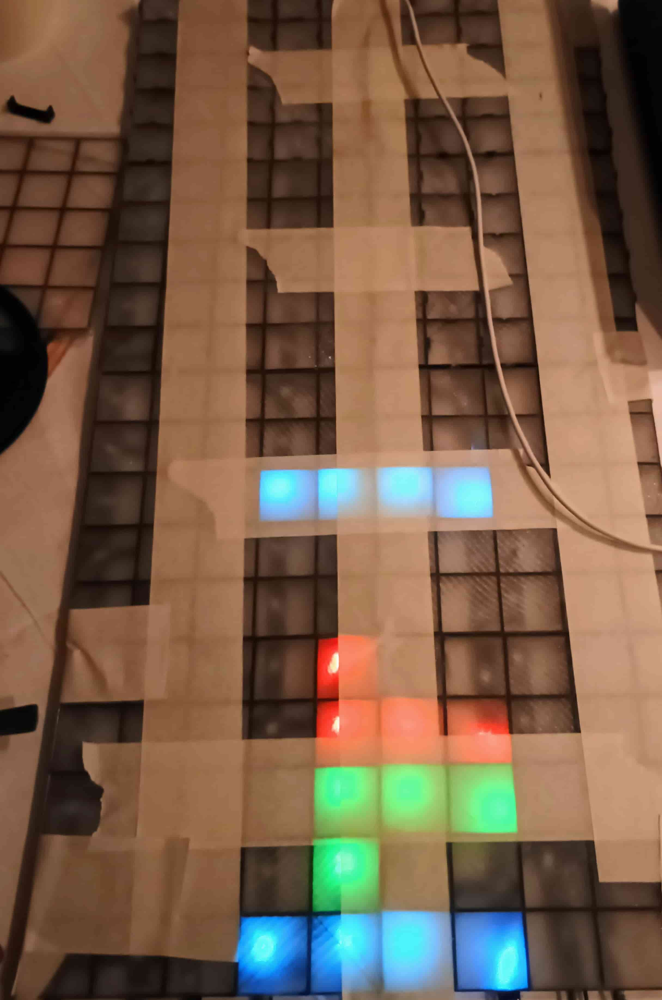
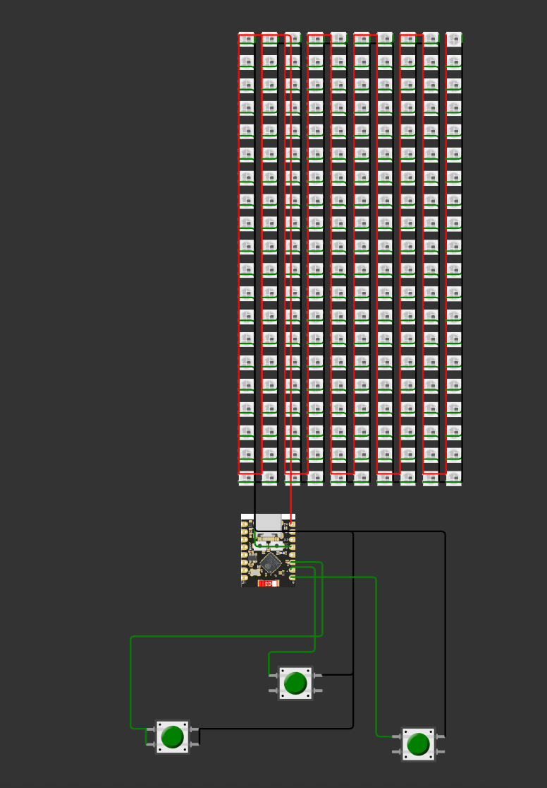

# No-STD Tetris on ESP32-C3 with NeoPixel LED Strip

<p align="center">
  
</p>

This project implements a classic Tetris game in `no_std` Rust, designed to run on an ESP32-C3 microcontroller, displaying the game on a NeoPixel LED strip. This example specifically targets the ESP32-C3 Super Mini board.

## Features

* Classic Tetris gameplay.
* Runs in a `no_std` environment, suitable for embedded systems.
* Utilizes a NeoPixel LED strip for vibrant display.
* Hardware button inputs for game control.

## Hardware Requirements

* **Microcontroller:** ESP32-C3 Super Mini (or a compatible ESP32-C3 board)
* **LED Strip:** NeoPixel (WS2812B or similar) LED strip. *[Perhaps specify the exact type/density you used for optimal results?]*
* **Buttons:** Three momentary push buttons.
* **Power Supply:** External 5V power adapter capable of powering both the ESP32-C3 and the LED strip. *[Consider adding an estimated current requirement if known, e.g., "at least 2A recommended depending on LED strip length"]*.
* **Wiring:** Jumper wires.

## Wiring Instructions

The ESP32-C3 Super Mini board and the NeoPixel LED strip are powered by an external 5V adapter. Ensure the adapter is connected to the 5V and GND pins of the ESP32-C3 and to the power input wires of the LED strip.

* **LED Strip Data Pin:** Connect to `GPIO4` on the ESP32-C3.
* **Left Button:** Connect between `GPIO2` on the ESP32-C3 and `GND`.
* **Middle (Rotate/Up) Button:** Connect between `GPIO1` on the ESP32-C3 and `GND`.
* **Right Button:** Connect between `GPIO0` on the ESP32-C3 and `GND`.

A visual representation of the wiring can be found below:

<p align="center">
  
</p>

## Build and Flash Instructions

1.  **Clone the Repository:**
    ```bash
    git clone https://github.com/Hahihula/no_std_tetris.git
    cd no_std_tetris/esp32_c3_example
    ```

2.  **Build the Project (Release Mode):**
    ```bash
    cargo build --release
    ```

3.  **Flash the Firmware:**
    Connect the ESP32-C3 to your computer.
    ```bash
    cargo espflash flash --release --monitor
    ```
    This command will flash the compiled program to the ESP32-C3 and then start monitoring the serial output.

    Alternatively, you can flash and monitor in separate steps:
    ```bash
    cargo espflash flash --release
    ```
    Then, to view serial output:
    ```bash
    cargo espflash monitor
    ```

## Game Controls

* **Left Button:** Move the falling tetromino left.
* **Right Button:** Move the falling tetromino right.
* **Middle (Up) Button:** Rotate the falling tetromino.

## Further Information

For more details regarding the ESP32-C3 Super Mini board and other Rust examples, please refer to this repository: [Hahihula/esp32-c3-super-mini-rust](https://github.com/Hahihula/esp32-c3-super-mini-rust).

## Troubleshooting

* **LED strip flickers or doesn't light up:**
    * Verify power supply connections and ensure it provides sufficient current.
    * Double-check the data pin wiring to `GPIO4`.
    * Ensure the correct LED strip type (e.g., WS2812B) is being used or that the code is configured for your specific strip.
* **The tetrominos are falling from bottom to up:**
    * you just wired the ledstrip the oposite way than I did, but no worries, the `board_to_led_index` function have parameter which will flip the Y axis, just change it in the code.

## Contributing

Contributions are welcome! Please feel free to submit a pull request or open an issue.

## License

MIT